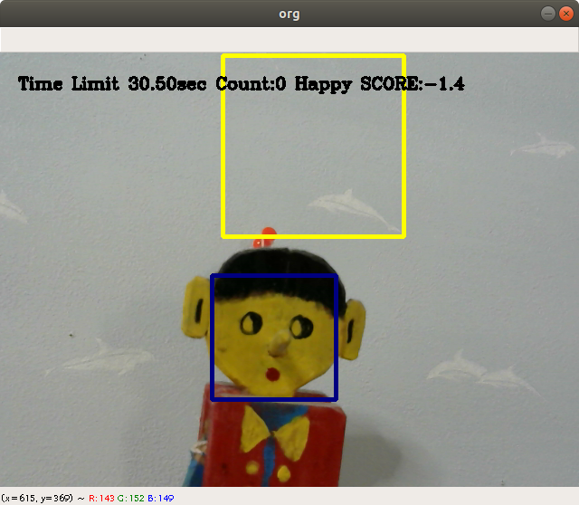

瞬間表情力テスト
==

## 概要
自分の顔の周りが青い矩形で囲まれます、黄色（Happy）かオレンジ（Angry）の矩形も表示されます。  
その矩形の枠の中に色に合わせた表情で顔を映してください。  
この映すスピードと表情力（何％の割合で表情を再現できているか）をスコア化します。  
CPUでもサクサク動くのでお手軽です。（CPUで動かす場合は下の注意を読んでから）


* Time Limit: 制限時間
* Count: 正解数
* Something: お題の表情(Happy or Angry)
* SCORE: スコア

## ルール
* 制限時間は1分間
* スコアが高ければ高いほど良い（瞬発表情力がある）
* 1人用
* カメラに向かって正面に顔を映さないと認識されないことがあるので正面に立ちましょう

## 使い方

### とりあえず実行するには
####環境を整える

動作環境は以下の通りです。
* Python3.6(EmoPyが3.6じゃないと動かない)
  
そして、以下のスクリプトをターミナルで実行します。
```bash
$ pip install EmoPy
$ pip uninstall scipy
$ pip install scipy==1.1.0
```


####EmoPyのコードを少し改良する（下を参考に）

予測値が返ってくるように少し改良させます。ファイルパスは環境によって異なりますが、
anacondaを使っている場合は下のパス通りのところにあるはずです。
>"
/home/username/anaconda3/envs/deep36/lib/python3.6/site-packages/EmoPy/src/fermodel.py  
60行目  
        # self._print_prediction(prediction[0]) # past  
        memo = self._print_prediction(prediction[0])  # add  
        return memo  # add  
60行目をコメントアウトし、後ろの2行を追加。  
113行目に  
        return [str(dominant_emotion), normalized_prediction[self.emotion_map[emotion]] * 100]  
を追加。  
実行結果が返ってくるように改良した。"  
####実行
まずは以下のようにフォルダを読み込んでください。  
```bash
$ cd ../bunkasai_face
```
コマンドは環境によって違うので取り敢えず、下のようになれば大丈夫です。（下は自分の環境）
```bash
(head_camera) yuma@yuma-desktop:~/PycharmProjects/bunkasai_headcamera$ 
```

main.pyを実行(TensorFlowがgpu版であれば実行時に--gpu又は-gオプションを付ける)

TF cpu版
```bash
$ python main.py
```

TF gpu版
```bash
$ python main.py -g
```

### ランキング機能
np.arrayの2次元配列です。1列目に名前、2列目にスコアが入っていてスコアでソートされるようになっています。  
csvにしなかったのは余計なライブラリを使いたくなかったからなので、余力があればcsvにしてみてください。（難しくはない）
